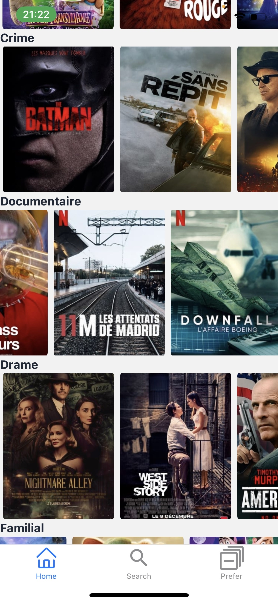

# NeoMovie

NeoMovie it is an application that allows you to list films with a search bar and to like them.  

<p align="center">
  
   
   
</p>

### :warning: Requirement

- [Docker](https://docs.docker.com/get-docker/)
- [Docker-compose](https://docs.docker.com/compose/install/)
- [NodeJS](https://github.com/nvm-sh/nvm)
- [yarn](https://classic.yarnpkg.com/lang/en/docs/install/#debian-stable)


### The Expo Client App

The Expo App will load the build bundle of the Expo CLI and allow you to test our app without deploying it or building with Android Studio.

Download links:
- [iOS](https://apps.apple.com/us/app/expo-client/id982107779)
- [Android](https://play.google.com/store/apps/details?id=host.exp.exponent)

### The Movie Database API

The app requires you to login with an account, with email and password.  
**Follow this link:** [The Movie Database API](https://developers.themoviedb.org/3/getting-started/introduction)

And get your `API_KEY`

### Set the environnement

Go to the file `./frontend/.env`  
And change the constant.  

```bash
API_TOKEN=YourApiKey
```


## Launch the App

- Open the expo client on your phone
- And run the code :

### With docker BACKEND

Have [Docker](https://docs.docker.com/get-docker/) and [Docker-compose](https://docs.docker.com/compose/install/) on your device.  

- Run `docker-compose up` in root

Documentation available by default to the route **/docs**


### With yarn FRONTEND

- Run `yarn install` in folder `frontend/`
- Update the `.env` as said above
- Run `yarn start`to start the development server
- Scan the QR code displayed in your terminal with your phone

## Authors
[<br><sub>Coline Seguret</sub>](https://github.com/Cleopha)
